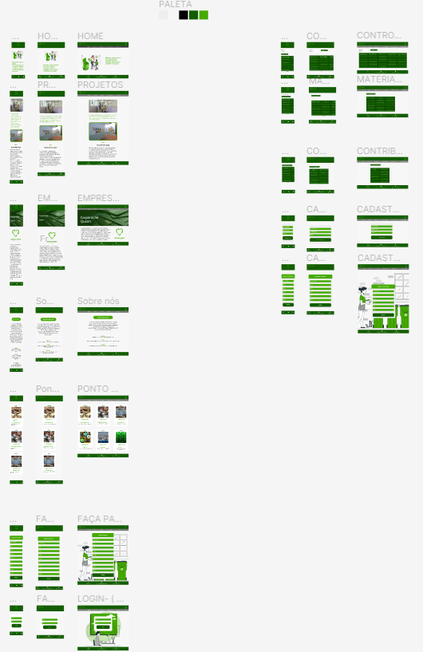
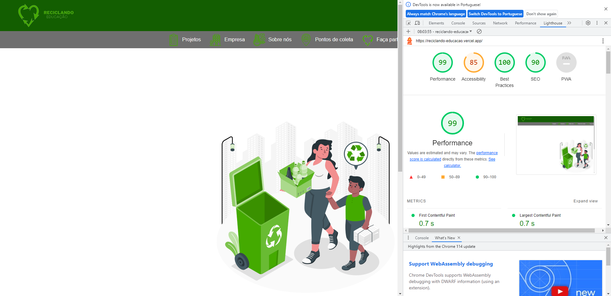

# Reciclando Educação

---

# Portfólio
---

[Clique aqui](https://reciclando-educacao.vercel.app/) para visitar o site.

---

### Sobre esse site:

Site desenvolvido para um projeto sobre reciclagem, para arrecadar produtos recicláveis que serão convertidos em recursos financeiros para a compra de materiais didáticos e reforma em escolas que estão localizada em cidades do Rio de Janeiro, com Índice de Desenvolvimento da Educação Paulista (IDEP) abaixo de 5,8 para o ensino fundamental.

Este site não é sobre uma empresa de verdade e sim para um projeto integrado, com FrontEnd, BackEnd e Banco de Dados, para aprimorar os conhecimentos obtidos no curso do [SENAI Jandira](https://jandira.sp.senai.br/).

---

<h1>TECNOLOGIAS APLICADAS</h1>
   

## Conceitos aplicados

- API
- ROUTER
- VLIBRAS

---
## Itens Adicionais

- Figma

[Clique aqui](https://www.figma.com/file/8UnrysItM9fHTTRUBzABCh/Apresenta%C3%A7%C3%A3o?type=design&node-id=0-1&t=gYIfAOIKTKukF1EC-0) para visitar o Figma.

---
## Relatório do LightHouse
O LightHouse básicamente analisa todo o seu site, indicando como está determinados aspectos do mesmo. Segue o relatório:

---
## Equipe
| [Bianca Duarte](https://github.com/biiaduartez) | Desenvolvedor Front-end |
| [Eduardo Ribeiro](https://github.com/Rib3r0)  | Desenvolvedor FullStack |
| [Gabriel Domingues](https://github.com/GABRIELDOMINGUESR) | Desenvolvedor Banco de Dados |
| [Gustavo Prevelate](https://github.com/GustavoPrevelate) | Desenvolvedor Front-end |

---