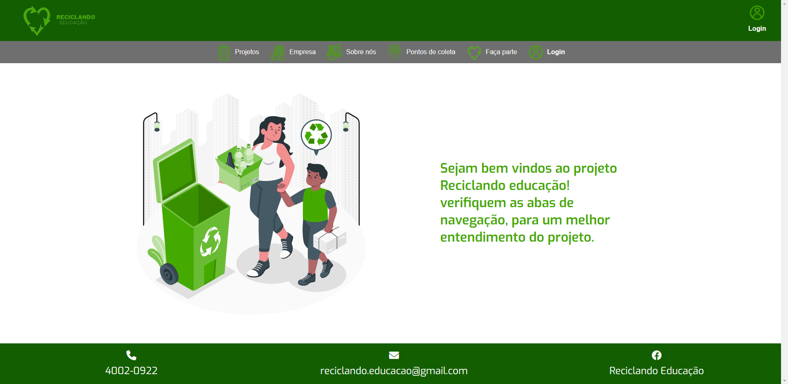

# Reciclando Educação

---

# Portfólio
---

[Clique aqui](https://reciclando-educacao.vercel.app/) para visitar o site.

---

### Sobre esse site:

Site desenvolvido para um projeto sobre reciclagem, para arrecadar produtos recicláveis que serão convertidos em recursos financeiros para a compra de materiais didáticos e reforma em escolas que estão localizada em cidades do Rio de Janeiro, com Índice de Desenvolvimento da Educação Paulista (IDEP) abaixo de 5,8 para o ensino fundamental.

Este site não é sobre uma empresa de verdade e sim para um projeto integrado, com FrontEnd, BackEnd e Banco de Dados, para aprimorar os conhecimentos obtidos no curso do [SENAI Jandira](https://jandira.sp.senai.br/).

---

<h1>TECNOLOGIAS APLICADAS</h1>
   

## Conceitos aplicados

- API
- ROUTER
- VLIBRAS

---
## Itens Adicionais

- Figma

[Clique aqui](https://www.figma.com/file/8UnrysItM9fHTTRUBzABCh/Apresenta%C3%A7%C3%A3o?type=design&node-id=0-1&t=gYIfAOIKTKukF1EC-0) para visitar o Figma.

---
## Relatório do LightHouse
O LightHouse básicamente analisa todo o seu site, indicando como está determinados aspectos do mesmo. Segue o relatório:

   <h1>COLABORADORES</h1>

| NOMES                                                                                                                                                                                      |                                                     GITHUB                                                      |                                       
| :----------------------------------------------------------------------------------------------------------------------------------------------------------------------------------------- | :-------------------------------------------------------------------------------------------------------------: | :------------------------------------------------------------------------------: |

   <a  href="https://github.com/biiaduartez">
    | 
     
    |
    </a>
     | 
   </a> 
   <a  href="https://github.com/Rib3r0">
    | 
     
    |
    </a>
     | 
   </a>
   <a  href="https://github.com/GABRIELDOMINGUESR">
    | 
     
    |
    </a>
     | 
   </a> 
   <a  href="https://github.com/GustavoPrevelate">
    | 
     
    |
    </a>
     
   </a> 

